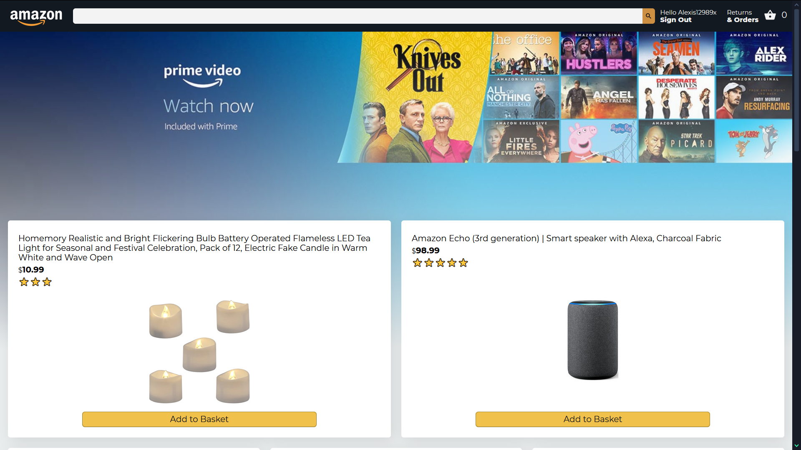

# Amazon Clone

A clone application based on Project of [CleverProgrammer](https://github.com/CleverProgrammer 'Rafeh Qazi')

## Live Preview

[Amazon Clone React App PWA](https://clone-4c3e1.web.app/ 'Amazone Clone App')

### Tech/framework used

<b>Built with</b>

-   [React](https://reactjs.org/)
-   [Firebase](https://firebase.google.com/?hl=en)

### Installation and Setup Instructions

Clone down this repository. You will need `node` and `npm` installed globally on your machine.

Installation: `npm install`

To Start Server: `npm start`

To Visit App: `localhost:3000/`

#### By **[a12989x](https://github.com/a12989x, 'Alexis Guzman')**
